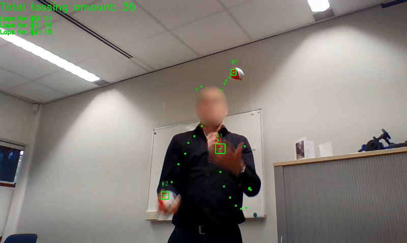
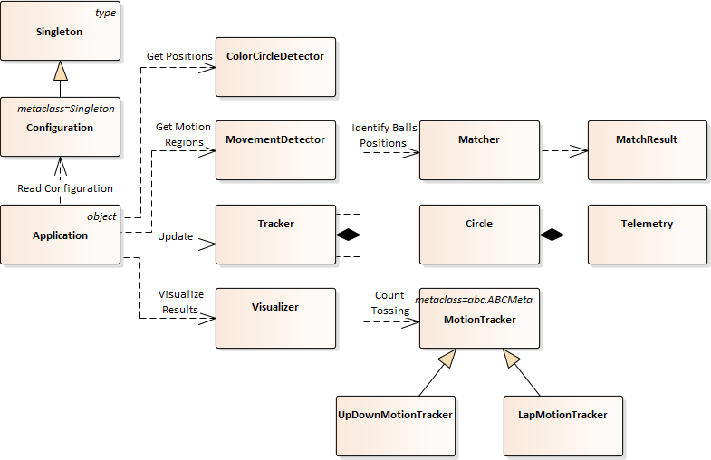

Juggling balls vision counter
-----------------------------

pyjuggling (juggling balls vision counter) is an application that detects juggling balls and tracks them to count how many times each juggling ball is tossed. The application is written using Python 3 programming language.

The detection process consists following phases:
1. Movement detection to consider only moving parts of each frame.
2. Position detection for each object with specific color range.
3. Matching obtained positions with existed balls or prediction of new position for each ball.

An example of video stream processing (the juggler's face is hidden):



Dependencies
------------

**Required packages**: cv2, numpy, imutils, pyclustering

**Python version**: >= 3.5


Project Structure
-----------------

- `examples` - contains example of separate components of the application.
- `juggling` - contains source code of the application.
- `tests` - contains unit-tests of the application.
- `tests/samples` - contains images that are used by examples and tests.


User Guide
----------

The application can be easily run using command line. Here is an example how to run the application to track three juggling balls (by default reddish juggling balls are expected):
```bash
python3 -m juggling -a 3
```

Here is an example how to run the application to track balls with orange color (HSV). Pay attention that color is specified as a range.
```bash
python -m juggling -a 2 -c "[[(10, 100, 120), (25, 255, 255)]]"
```

It is possible to specify several ranges for balls detection, here is an example:
```bash
python -m juggling -a 2 -c "[[(0, 150, 120), (10, 255, 255)], [(170, 150, 120), (180, 255, 255)]]"
```

To process video file instead of video stream from a camera:
```bash
python -m juggling -a 3 -p juggling_movie.mp4
```

The level of perception of movements can be also changed (the higher value requires "the most visible" movements):
```bash
python -m juggling -a 3 -p juggling_movie.mp4 -t 20
```

To see other possible options use `--help`


Architecture
------------


